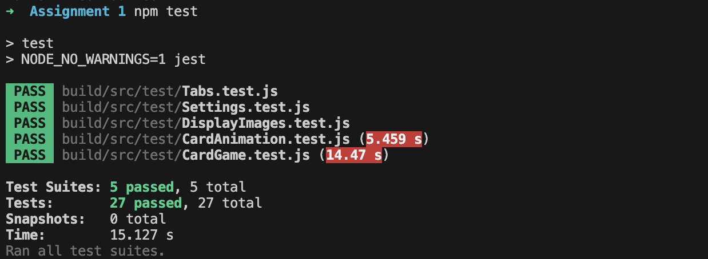

# Memory Game

Before starting if you'd like to view this file properly, please open it with [Visual Studio Code](https://code.visualstudio.com/) and click Ctrl+Shift+V (Command+Shift+V on Mac). The text can be seen without doing this but it won't be formatted correctly.

This javascript project undertaken as part of Assignment 1 for Web Systems Engineering. 
Below are the instructions to run the project and the automatic testing suites that its bundled with.

I've put a lot of care and attention into the design of the website from validation to protecting the user from themselves. For example, the cards are not clickable after they've been matched so you can't match more cards than should be possible.

## How it works

The application goes through several steps to set up the cards so the user can play. The website will first check if there is any previous play data and load it on the display if there is something. 

It will then create an array of cards based on the number of cards chosen in the settings which are then randomised using the shuffle function. After the cards array has been created, the cards are then made clickable. The click event code will include a lot of the game logic such as which card to show, animation to play and finally the win condition. 

From there the game has been set up but the website also sets up the final few bits of functionality. It sets up the tabs at the top of the page as well as the save settings button in the settings tab. 

## Running the project

### All Operating Systems

Running the project is simple. The zip file should have everything you need. All you need to do is extract the project into your file explorer and go into the `build` folder. Now right-click on the `index.html` file and hover over `open with`. Now, all you need to do is find your preferred web browser and click on it. The website is now fully loaded and ready for you!

## Testing the project

Below I have laid out the instructions to run the automatic tests I have bundled with the project. By the end of it, you should have an output to the console that looks like this:

### Prerequisites

#### For Mac/Linux

1. You will need nodeJS to run the tests for this project. The easiest way to install nodeJS for Mac/Linux is by first installing `homebrew` from the [brew website](https://brew.sh/).
2. Now you should be able to type:

        brew install node

   into your terminal to install nodeJS

#### For Windows

1. You will need nodeJS to run the tests for this project. The easiest way to install nodeJS on Windows is by going to the [nodeJS website](https://nodejs.org/en/download/package-manager) and following their instructions for Windows.

### Running the tests

> Note: I would recommend doing the following section in [Visual Studio Code](https://code.visualstudio.com/) as it's easier to edit the javascript files and it bundles with a built-in terminal but this section assumes you don't have it.

1. Go into your terminal and navigate to where you have stored this project. 

2. Open the following files (in `build/src/main`):

        CardAnimation.js
        CardGame.js
        DisplayImages.js
        Settings.js
        Tabs.js

    and uncomment this last line from each file:

        // module.exports = FILE_NAME.js;

    (it should look like this when uncommented):

        module.exports = FILE_NAME.js;

3. You should now be able to go into your terminal and type:

        npm test

    The tests should now all run!

> Final Note: If you want to run the index.html, all the functionality will work fine but it will produce errors in the console saying it can't find "module" (because of nodeJS). If you want to remove these errors, recomment the lines you uncommented earlier. 

## Known Issues

- As mentioned before, the project can run just fine when the `module.exports = FILE_NAME.js;` line is uncommented but it produces errors in the console. 

    Since the functionality is unaffected by the tests and it would be too time-consuming to rebuild the entire application in nodeJS I've opted to uncomment and comment the line based on the project need as it was the cleanest solution.

- There is also another issue where if the user reloads the website the name they input will stay in the name input box (under settings). But if they choose to click `New Game` it will remove the name from the input box.

    This is a small issue that doesn't affect the game. Its a small quality of life fix that wasn't within the scope of the project.

- Lastly, the CSS and design is quite consistent but preferably I'd like for each of the tabs to be the same size. 

    I couldn't think of a way to do this without fundamentally changing the design of the entire website to I have left this for now.

## Future Features

In the future, I'd like to add a couple features to either extend the functionality of the game or improve the quality of life for the user.

- The ability for the user to upload their own images. This is another quality of life feature that will make the game more fun and customisable.

- Flexibility for the website to work on mobile. Currently its optimised for a computer but is not easily playable on mobile.

- Lastly, I could make a global leaderboard using a database and APIs so that anyone could go onto the website and see where they rank globally. There is also a simpler local leaderboard I could implement where each player would play on one computer. I could do this before moving onto the more complicated version.

## Additional Manual Testing

In addition to the automatic tests run by nodeJS (set up earlier) I also did manual testing using the console to make sure everything worked perfectly.

I did this because while the numbers in the background may be correct (according to my automatic tests) it may not be correct visually on the website which is as a result of it not being able possible to test the CSS and HTML automatically.

One example in particular came from the animations. It was difficult to get the animations right because there were a lot of little things that went wrong with it. For example, the card would overrotate and show more of the back of the card than it was supposed to or when the cards are supposed to shrink to zero sometimes they would go into negative shrinkage which reverses the image and makes it bigger! 

I used a console output to tell me what the current rotation of the card was as well as the current scale which allowed me to correct and iron out any bugs the animation had.

A particularly annoying issue is when I tried to rotate the card and it would show the other side of the card in the wrong orientation for a split second. This was a surprisingly subtle issue with how I was handling changing the style of the element. When I needed to shrink the element it overwrote the entire styling which reset the rotation that had been applied to it.
